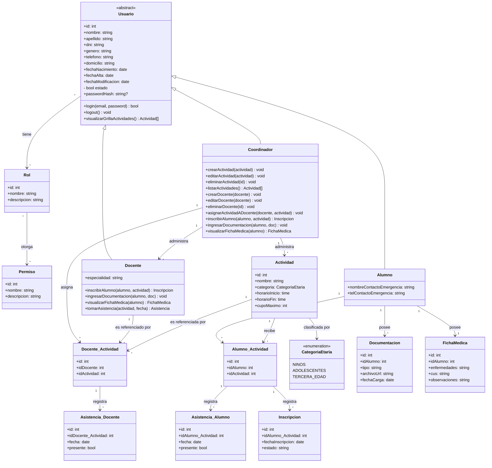

# Diagrama UML - Área de Deportes

```mermaid
classDiagram
    direction TB

    class Usuario {
        <<abstract>>
        +id: int
        +nombre: string
        +apellido: string
        +dni: string
        +genero: string
        +telefono: string
        +domicilio: string
        +fechaNacimiento: date
        +fechaAlta: date
        +fechaModificacion: date
        - bool estado
        +passwordHash: string?
        +login(email, password) bool
        +logout() void
        +visualizarGrillaActividades() Actividad[]
    }

    class Rol {
        +id: int
        +nombre: string
        +descripcion: string
    }

    class Permiso {
        +id: int
        +nombre: string
        +descripcion: string
    }

    class Docente {
        +especialidad: string
        +inscribirAlumno(alumno, actividad) Inscripcion
        +ingresarDocumentacion(alumno, doc) void
        +visualizarFichaMedica(alumno) FichaMedica
        +tomarAsistencia(actividad, fecha) Asistencia
    }

    class Coordinador {
        +crearActividad(actividad) void
        +editarActividad(actividad) void
        +eliminarActividad(id) void
        +listarActividades() Actividad[]
        +crearDocente(docente) void
        +editarDocente(docente) void
        +eliminarDocente(id) void
        +asignarActividadADocente(docente, actividad) void
        +inscribirAlumno(alumno, actividad) Inscripcion
        +ingresarDocumentacion(alumno, doc) void
        +visualizarFichaMedica(alumno) FichaMedica
    }

    class Actividad {
        +id: int
        +nombre: string
        +categoria: CategoriaEtaria
        +horarioInicio: time
        +horarioFin: time
        +cupoMaximo: int
    }

    class Docente_Actividad {
        +id: int
        +idDocente: int
        +idActividad: int
    }
    class Alumno_Actividad {
        +id: int
        +idAlumno: int
        +idActividad: int
    }
    class CategoriaEtaria {
        <<enumeration>>
        NINOS
        ADOLESCENTES
        TERCERA_EDAD
    }

    class Alumno {
        +nombreContactoEmergencia: string
        +telContactoEmergencia: string
    }

    class Inscripcion {
        +id: int
        +idAlumno_Actividad: int
        +fechaInscripcion: date
        +estado: string
    }

    class Documentacion {
        +id: int
        +idAlumno: int
        +tipo: string
        +archivoUrl: string
        +fechaCarga: date
    }

    class FichaMedica {
        +id: int
        +idAlumno: int
        +enfermedades: string
        +cus: string
        +observaciones: string
    }

    class Asistencia_Alumno {
        +id: int
        +idAlumno_Actividad: int
        +fecha: date
        +presente: bool
    }

    class Asistencia_Docente {
        +id: int
        +idDocente_Actividad: int
        +fecha: date
        +presente: bool
    }

    Usuario <|-- Alumno
    Usuario <|-- Docente
    Usuario <|-- Coordinador
    Usuario "*" --> "*" Rol : tiene
    Rol "*" --> "*" Permiso : otorga

    Coordinador "1" --> "*" Docente : administra
    Coordinador "1" --> "*" Actividad : administra
    Coordinador "1" --> "*" Docente_Actividad : asigna
    Docente "1" --> "*" Docente_Actividad : es referenciado por
    Actividad "1" --> "*" Docente_Actividad : es referenciada por
    Actividad --> CategoriaEtaria : clasificada por

    Alumno "1" --> "*" Documentacion : posee
    Alumno "1" --> "1" FichaMedica : posee
    Alumno "1" --> "*" Alumno_Actividad : participa
    Actividad "1" --> "*" Alumno_Actividad : recibe
    Alumno_Actividad "1" --> "*" Inscripcion : registra
    Alumno_Actividad "1" --> "*" Asistencia_Alumno : registra
    Docente_Actividad "1" --> "*" Asistencia_Docente : registra
```
